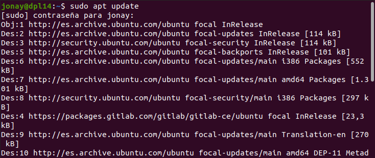
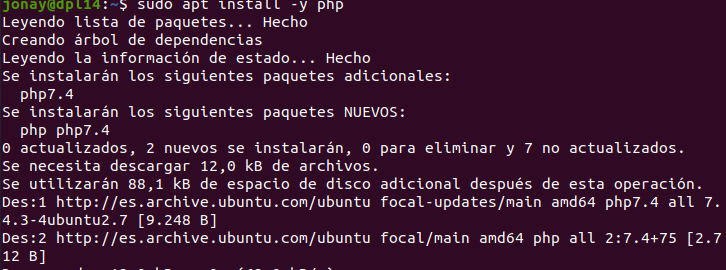
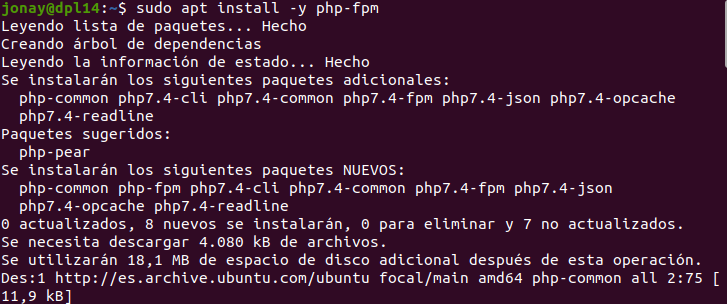
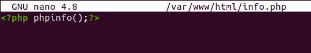
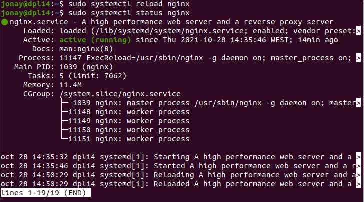
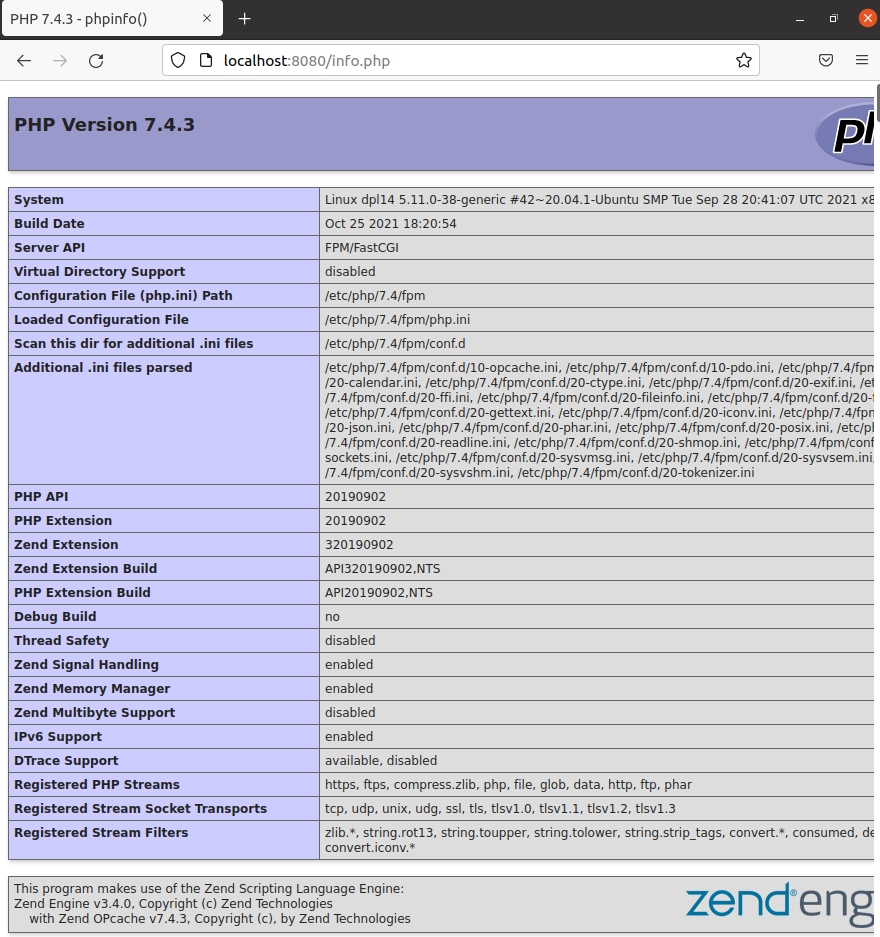
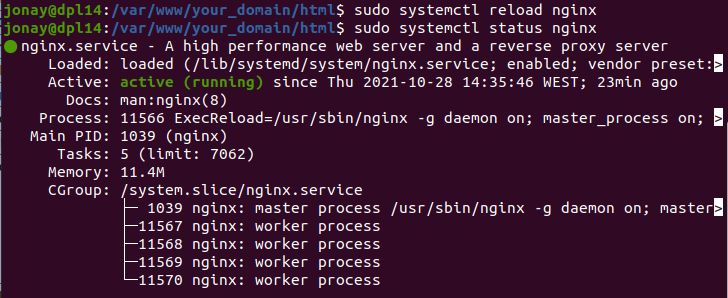
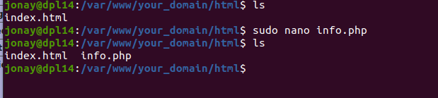

# Instalación PHP.


## 1. Introducción.
PHP es un lenguaje de programación del lado del servidor, es de código abierto y de los mas usados para desarrollo web gracias a que puede ser incrustado en HTML.

En esta practica vamos a ver la instalación de PHP en un servidor Ubuntu 20.04 y a continuación veremos su configurado para que un servidor web como es el caso de Apache y Nginx pueda localizarlo.

## 2. Instalación de PHP.
Primero, antes de proceder a instalar de PHP para el servidor Apache, es recomendable que se actualicen tanto los paquete como el sistema, por lo que debemos usar los siguiente comandos.
```
sudo apt upgrade && sudo apt update
```




En el caso de apache vamos a usar el paquete libapache2-mod-php, para ello usamos: 
```
sudo apt install -y php
```




En el caso de nginx vamos a usar el paquete php-fpm, para ello usamos: 
```
sudo apt install y php-fpm
```




Para el caso de Nginx es necesario configurar lo para que se puede conectar al servicio de PHP, para ello vamos a editar el siguiente fichero de configuración:
```
sudo nano /etc/nginx/sites-available/default
```


Y des comentamos las lineas para que el fichero quede de la siguiente manera.




Al terminar de modificar el fichero recargamos la configuración del servicio Nginx con:
```
sudo systemctl reload nginx
```




## 3. Probar PHP.
Para probar que tenemos el PHP funcionando y los servidores pueden mostrar código de PHP vamos a crear un pequeño fichero “info.php” en la ruta “/var/www/html” con la siguiente información.


Con esto si accedemos al puerto del servidor web con “/info.php” deberíamos ver los siguiente.




## 4. Configurar PHP en un dominio propio Nginx.
En Nginx podemos tener dominio personalizado como se ha realizado en Instalación y configuración de Nginx, pues vamos a ver como añadir PHP a nuestro dominio que creamos en ese mismo guion.

Primero abrimos el fichero de configuración de nuestro dominio y añadimos las siguientes lineas.
```
location ~ \.php {
	include snippets/fastcgi-php.conf;
	fastcgi_pass unix:/var/run/php/php7.4-fpm.sock;
}
```

Al terminar de modificar el fichero recargamos la configuración del servicio Nginx con:
```
sudo systemctl reload nginx
```




Tras esto como hicimos antes vamos a crear el fichero “info.php” en “/var/www/yourDomain/html/”




Y por ultimo accedemos igual que antes pero con la dirección del dominio “yourDomain/info.php”.
